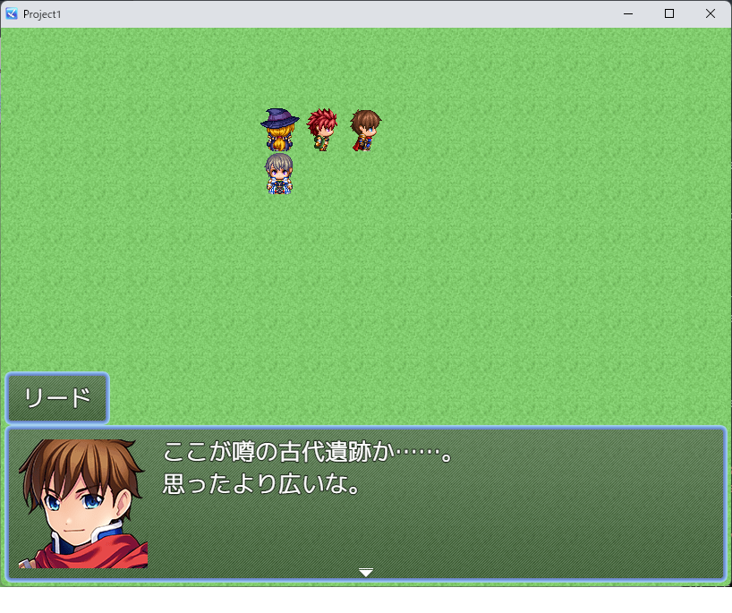
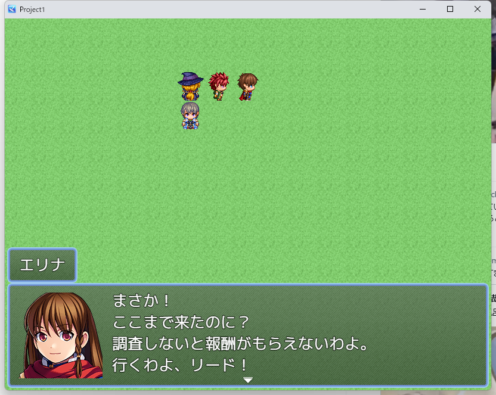
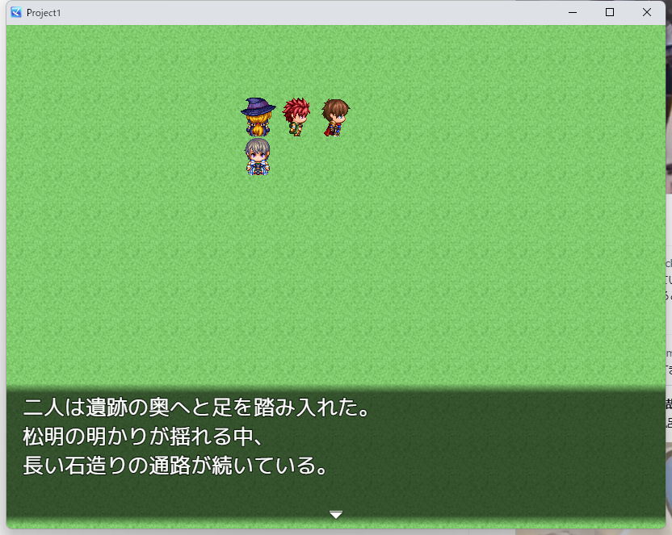
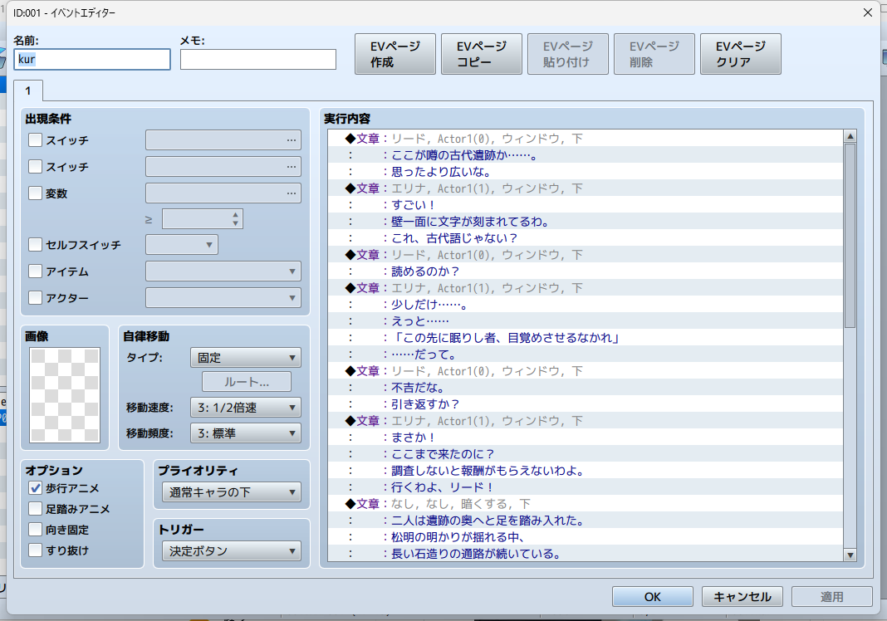
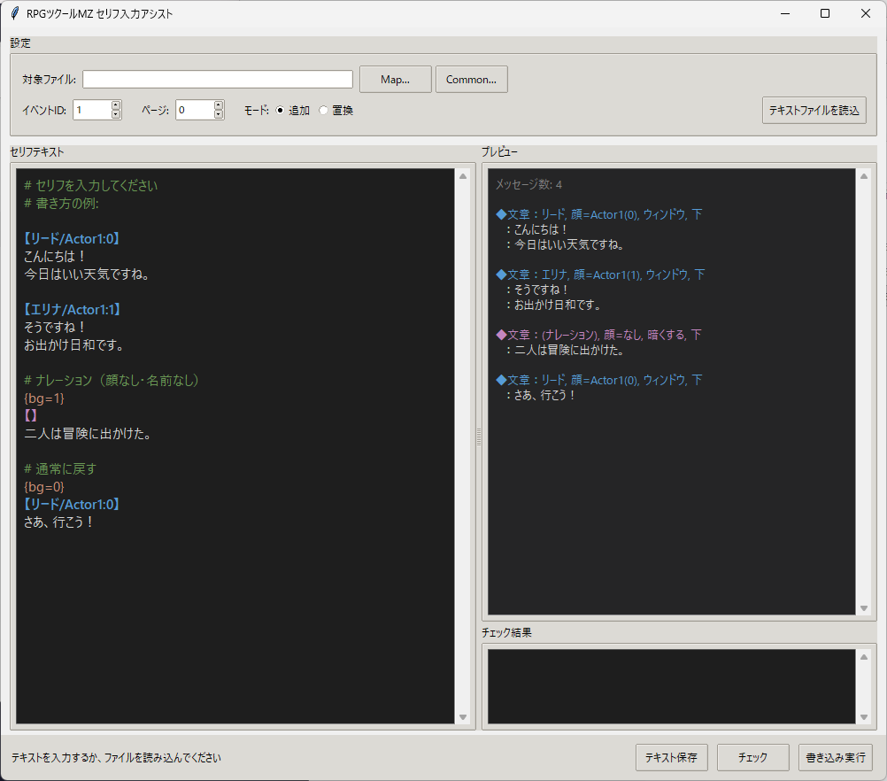

# RPGツクールMZ セリフ一括入力ツール 説明書

## これは何？

テキストファイルに書いたセリフを、RPGツクールMZのイベントコマンド「文章の表示」として
マップファイル（MapXXX.json）に一括で書き込むツールです。

ツクールMZを開かずに、セリフを流し込めます。

### ツクールMZでの表示結果

テキストファイルから自動生成されたセリフがゲーム内でそのまま表示されます。

**顔グラ+名前付きセリフ（リード）**



**話者切替（エリナ）**


**4行セリフ**



**ナレーション（顔なし・名前なし・背景「暗くする」）**



**イベントエディタでの表示**



---

## 画面の見方



- **左**: セリフエディタ（シンタックスハイライト付き）
- **右上**: リアルタイムプレビュー（変換結果を即表示）
- **右下**: チェック結果（エラー・警告を表示）
- **上部**: マップファイル選択・イベントID・ページ指定
- **下部**: チェック実行・テキスト保存・書き込み実行

---

## 必要なもの

- `serif_gui.exe`（このツール）
- RPGツクールMZプロジェクトの `data/MapXXX.json` ファイル

※ Python不要。exe単体で動きます。

---

## 使い方

### ステップ1: serif_gui.exe を起動する

ダブルクリックで起動します。サンプルテキストが表示されます。

### ステップ2: セリフを書く

左のエディタにセリフを入力します。右のプレビューにリアルタイムで変換結果が表示されます。

テキストファイルの読み込み・保存もできます（「テキストファイルを読込」「テキスト保存」ボタン）。

### ステップ3: ツクールMZを閉じる

**重要**: ツクールMZが開いていると、ツクール側で上書きされてしまいます。
必ずツクールMZを閉じた状態で書き込みしてください。

### ステップ4: マップファイルを選択する

「参照...」からプロジェクトの `data/MapXXX.json` を選択します。
イベントIDとページ番号を指定します。

### ステップ5: チェック → 書き込み

「チェック」ボタンでエラーや警告を確認してから、「書き込み実行」で書き込みます。

### ステップ6: ツクールMZで確認する

プロジェクトを開くと、指定したイベントにセリフが追加されています。

---

## テキストフォーマット一覧

### 話者の指定

| 書き方 | 意味 |
|--------|------|
| `【リード/Actor1:0】` | 名前「リード」、顔グラ「Actor1」のインデックス0 |
| `【エリナ/Actor2:3】` | 名前「エリナ」、顔グラ「Actor2」のインデックス3 |
| `【村人】` | 名前「村人」、顔グラなし |
| `【】` | 名前なし・顔グラなし（ナレーション） |

一度指定すると、次のヘッダが来るまで同じ設定が使われます。

### 顔番号の対応

顔ファイルは 4列×2行 = 8枚の顔画像で構成されています。

```
┌───┬───┬───┬───┐
│ 0 │ 1 │ 2 │ 3 │
├───┼───┼───┼───┤
│ 4 │ 5 │ 6 │ 7 │
└───┴───┴───┴───┘
```

### 背景の変更

行に `{bg=数字}` と書くと、以降のメッセージの背景が変わります。

| 書き方 | 意味 |
|--------|------|
| `{bg=0}` | ウィンドウ（デフォルト） |
| `{bg=1}` | 暗くする |
| `{bg=2}` | 透明 |

### ウィンドウ位置の変更

行に `{pos=数字}` と書くと、以降のメッセージの表示位置が変わります。

| 書き方 | 意味 |
|--------|------|
| `{pos=0}` | 上 |
| `{pos=1}` | 中 |
| `{pos=2}` | 下（デフォルト） |

### コメント

`#` で始まる行は無視されます。シーン見出しなどに使えます。

```
# --- シーン1: 冒頭 ---
```

### 空行

空行は「文章の表示」コマンドの区切りです。
空行を入れると、次のテキストは新しい「文章の表示」コマンドになります。

### 4行超えの自動分割

RPGツクールMZの「文章の表示」は1コマンドあたり最大4行です。
5行以上書くと、自動的に複数のコマンドに分割されます。

---

## フルサンプル

```
# シーン1: 冒頭

【リード/Actor1:0】
ここが噂の古代遺跡か……。
思ったより広いな。

【エリナ/Actor1:1】
すごい！
壁一面に文字が刻まれてるわ。
これ、古代語じゃない？

# シーン2: ナレーション

{bg=1}
【】
二人は遺跡の奥へと足を踏み入れた。
松明の明かりが揺れる中、
長い石造りの通路が続いている。

# シーン3: 演出（透明ウィンドウ・画面上部）

{bg=2}
{pos=0}
【】
暗闘の中から、一つの影が現れた。

# 通常に戻す
{bg=0}
{pos=2}
【守護者/Actor2:7】
我は守護者。
この遺跡を千年にわたり守る者だ。
```

---

## 注意事項

- **書き込み前にツクールMZを必ず閉じてください**。開いたまま実行すると、ツクール側の保存で上書きされます。
- 元のMapファイルは自動で `.bak` にバックアップされます。
- 既存のイベントコマンドの末尾に追加されます。既存コマンドを消したい場合は、事前にツクールMZ上でクリアしてください。
- 顔ファイル名はプロジェクトの `img/faces/` フォルダにあるファイル名（拡張子なし）を指定してください。
- ウイルス対策ソフトがexeをブロックする場合があります。その場合は除外設定を追加してください。

---

## 権利表記（任意）

クレジットにすばら３があると嬉しいです（なくてもいいです）。

## 免責事項

本ツールの使用によって生じた、いかなる損害についても作者は一切の責任を負いません。自己責任でご利用ください。マップデータの書き込み前に自動バックアップが作成されますが、念のため手動でもバックアップを取ることをおすすめします。

---

## リンク

- [紹介記事（すばら３のホームページ）](https://subara3.com/memo/tech/tkool-serif-assist)
- [GitHub リポジトリ](https://github.com/Subara3/tkool-serif-assist)
